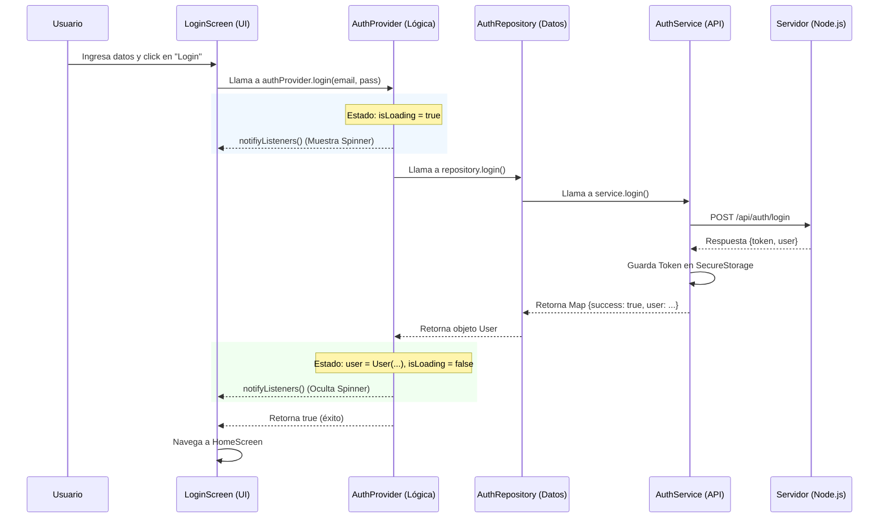
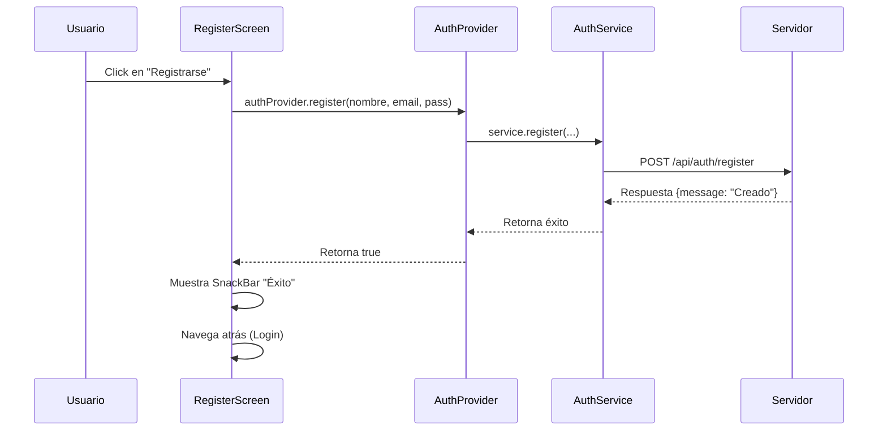

# Explicación de la Arquitectura y Flujo de Datos

Esta guía explica cómo funciona tu aplicación después de la refactorización, detallando el viaje de los datos desde que el usuario toca un botón hasta que el backend responde.

## Estructura del Proyecto (Capas)

Hemos organizado la app en 3 capas principales para que sea ordenada y fácil de mantener:

1.  **Capa de Presentación (UI)**:
    *   **Qué es**: Son tus pantallas (`Screens`) y widgets.
    *   **Responsabilidad**: Mostrar datos al usuario y capturar sus acciones (clics, texto). **No toma decisiones lógicas**, solo "pide" cosas al Provider.
    *   *Ejemplo*: [LoginScreen](file:///home/deuseros/Documentos/GitHub/ontrack-cl/ontrack-cl/frontend/lib/screens/login_screen.dart#5-11), [RegisterScreen](file:///home/deuseros/Documentos/GitHub/ontrack-cl/ontrack-cl/frontend/lib/screens/register_screen.dart#5-11).

2.  **Capa de Lógica de Negocio (Provider)**:
    *   **Qué es**: El "cerebro" de la app en el frontend ([AuthProvider](file:///home/deuseros/Documentos/GitHub/ontrack-cl/ontrack-cl/frontend/lib/providers/auth_provider.dart#6-118)).
    *   **Responsabilidad**: Mantiene el **estado** de la app (¿está cargando? ¿quién es el usuario? ¿hay error?). Recibe órdenes de la UI y decide qué hacer con ellas. Notifica a la UI cuando algo cambia para que se redibuje.

3.  **Capa de Datos (Repository & Service)**:
    *   **Qué es**: El "mensajero" ([AuthRepository](file:///home/deuseros/Documentos/GitHub/ontrack-cl/ontrack-cl/frontend/lib/repositories/auth_repository.dart#4-12), [AuthService](file:///home/deuseros/Documentos/GitHub/ontrack-cl/ontrack-cl/frontend/lib/services/auth_service.dart#9-170)).
    *   **Responsabilidad**: Saber **de dónde** sacar los datos.
        *   **Repository**: Define *qué* datos necesitamos (contrato).
        *   **Service (DataSource)**: Hace el trabajo sucio de hablar con la API (HTTP) o guardar en el celular (Secure Storage).

---

## Flujo de Datos: Login

Imagina que el usuario ingresa su email y contraseña y toca "Iniciar Sesión". Esto es lo que sucede paso a paso:

### Explicación Paso a Paso (Login)

1.  **UI ([LoginScreen](file:///home/deuseros/Documentos/GitHub/ontrack-cl/ontrack-cl/frontend/lib/screens/login_screen.dart#5-11))**:
    *   El usuario toca el botón.
    *   La pantalla llama a `context.read<AuthProvider>().login(...)`.
    *   **Ojo**: La pantalla *no sabe* cómo se hace el login, solo le dice al Provider "hazlo".

2.  **Provider ([AuthProvider](file:///home/deuseros/Documentos/GitHub/ontrack-cl/ontrack-cl/frontend/lib/providers/auth_provider.dart#6-118))**:
    *   Pone `_isLoading = true` y avisa a la UI (`notifyListeners`). La UI se redibuja y muestra el circulito de carga.
    *   Llama al repositorio: `_authRepository.login(...)`.

3.  **Repository ([AuthRepositoryImpl](file:///home/deuseros/Documentos/GitHub/ontrack-cl/ontrack-cl/frontend/lib/repositories/auth_repository.dart#13-61))**:
    *   Actúa de intermediario. Llama al servicio `_authService.login(...)`.
    *   Si el servicio responde bien, convierte esos datos "crudos" en un objeto [User](file:///home/deuseros/Documentos/GitHub/ontrack-cl/ontrack-cl/frontend/lib/repositories/auth_repository.dart#47-50) limpio y lo devuelve. Si falla, lanza un error claro.

4.  **Service ([AuthService](file:///home/deuseros/Documentos/GitHub/ontrack-cl/ontrack-cl/frontend/lib/services/auth_service.dart#9-170))**:
    *   Prepara el JSON.
    *   Hace la petición HTTP `POST` a tu backend (`http://localhost:3000...`).
    *   Recibe la respuesta. Si es exitosa, **guarda el Token JWT** en el celular (usando `flutter_secure_storage`) para que la sesión no se pierda.

5.  **De vuelta al Provider**:
    *   Recibe el usuario del repositorio.
    *   Lo guarda en su variable `_user`.
    *   Pone `_isLoading = false`.
    *   Avisa a la UI (`notifyListeners`).

6.  **De vuelta a la UI**:
    *   Recibe la confirmación (`true`).
    *   Usa `Navigator` para cambiar a la pantalla de Home.

---

## Flujo de Datos: Register

Es muy similar al Login, pero con un paso extra de creación.

### Diferencia Clave
En el registro, generalmente **no iniciamos sesión automáticamente** (aunque podríamos). En tu código actual:
1.  Se crea el usuario en el backend.
2.  El backend responde "OK".
3.  La UI recibe el "OK", muestra un mensaje y devuelve al usuario a la pantalla de Login para que entre con su nueva cuenta.

## ¿Por qué es mejor esto que lo que tenías antes?

1.  **Orden**: Si falla la API, revisas el [Service](file:///home/deuseros/Documentos/GitHub/ontrack-cl/ontrack-cl/frontend/lib/services/auth_service.dart#9-170). Si falla la lógica de estado, revisas el [Provider](file:///home/deuseros/Documentos/GitHub/ontrack-cl/ontrack-cl/frontend/lib/providers/auth_provider.dart#6-118). Si falla el diseño, revisas la [Screen](file:///home/deuseros/Documentos/GitHub/ontrack-cl/ontrack-cl/frontend/lib/screens/home_screen.dart#6-12). Antes todo estaba mezclado.
2.  **Mantenimiento**: Si mañana cambias tu backend por Firebase, solo cambias el [AuthRepositoryImpl](file:///home/deuseros/Documentos/GitHub/ontrack-cl/ontrack-cl/frontend/lib/repositories/auth_repository.dart#13-61). Tu UI ([LoginScreen](file:///home/deuseros/Documentos/GitHub/ontrack-cl/ontrack-cl/frontend/lib/screens/login_screen.dart#5-11)) ni se entera, no tienes que tocar ni una línea de código visual.
3.  **Reactividad**: Gracias al [Provider](file:///home/deuseros/Documentos/GitHub/ontrack-cl/ontrack-cl/frontend/lib/providers/auth_provider.dart#6-118), cualquier cambio en el usuario (como hacer logout) se puede reflejar instantáneamente en cualquier parte de la app que esté escuchando.
