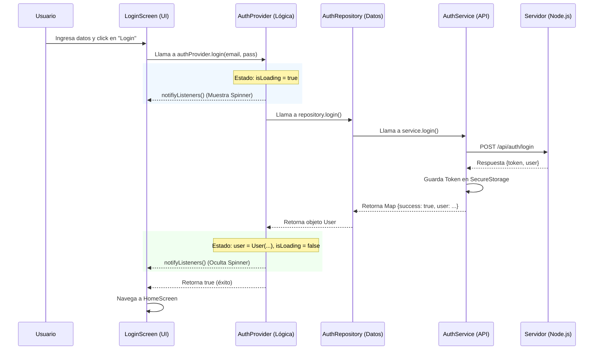

# 🚀 Ontrack - Frontend


Bienvenido al repositorio frontend de **Ontrack**. Esta aplicación está construida con Flutter y sigue una arquitectura limpia y escalable para garantizar un desarrollo eficiente y mantenible.

---

## 🏁 Comenzando

Sigue estos pasos para configurar el proyecto en tu máquina local.

### Prerrequisitos

*   [Flutter SDK](https://docs.flutter.dev/get-started/install) instalado.
*   Un editor de código (recomendado [VS Code](https://code.visualstudio.com/) con la extensión de Flutter).
*   El backend de Ontrack corriendo localmente (por defecto en `http://localhost:3000`).

### Instalación

1.  **Clonar el repositorio:**
    ```bash
    git clone https://github.com/tu-usuario/ontrack-cl.git
    cd ontrack-cl/frontend
    ```

2.  **Instalar dependencias:**
    ```bash
    flutter pub get
    ```

### Ejecutar la App

Para correr la aplicación en modo debug (por ejemplo, en Chrome):

```bash
flutter run -d chrome
```

---

## 📂 Estructura del Proyecto

El proyecto sigue una estructura **organizada por características (features)** dentro de la carpeta `screens`, y una separación clara de capas.

```
lib/
├── models/          # 📦 Modelos de datos (Podos)
├── providers/       # 🧠 Lógica de negocio y Estado (ChangeNotifier)
├── repositories/    # 🤝 Contratos e implementación de repositorios
├── services/        # 🌐 Comunicación con API externa (HTTP)
├── screens/         # 📱 Pantallas de la aplicación
│   ├── auth/        #    - Feature: Autenticación
│   │   ├── widgets/ #      - Widgets exclusivos de Auth
│   │   ├── login_screen.dart
│   │   └── register_screen.dart
│   ├── home/        #    - Feature: Home
│   │   └── home_screen.dart
│   ├── welcome/     #    - Feature: Bienvenida
│   │   └── welcome_screen.dart
│   └── leaderboard/ #    - Feature: Leaderboard
│       └── leaderboard_screen.dart
└── main.dart        # 🚀 Punto de entrada
```

---

## 🏗️ Arquitectura y Flujo de Datos

Hemos organizado la app en 3 capas principales para que sea ordenada y fácil de mantener:

### 1. Capa de Presentación (UI)
*   **Qué es**: Son tus pantallas (`Screens`) y widgets.
*   **Responsabilidad**: Mostrar datos al usuario y capturar sus acciones. **No toma decisiones lógicas**, solo interactúa con el `Provider`.

### 2. Capa de Lógica de Negocio (Provider)
*   **Qué es**: El "cerebro" de la app ([AuthProvider](lib/providers/auth_provider.dart)).
*   **Responsabilidad**: Mantiene el **estado** de la app (loading, usuario, errores). Recibe eventos de la UI, procesa la lógica y notifica los cambios.

### 3. Capa de Datos (Repository & Service)
*   **Qué es**: El "mensajero".
*   **Repository**: Define *qué* datos necesitamos (abstracción).
*   **Service**: Define *cómo* obtenerlos (implementación HTTP, Local Storage).

### Diagrama de Flujo: Login



---

## 🛡️ Guías de Desarrollo

Para mantener el código limpio y escalable, sigue estas reglas:

1.  **Feature-First**: Si creas una nueva funcionalidad (ej. "Perfil"), crea una carpeta `profile` dentro de `screens` y pon ahí todo lo relacionado (pantallas y widgets específicos).
2.  **Widgets Reutilizables**: Si un widget se usa en más de una feature, muévelo a una carpeta `lib/widgets` global (si existiera) o `lib/common`.
3.  **Lógica en el Provider**: Nunca pongas lógica de negocio compleja (llamadas HTTP, validaciones de negocio) dentro de los widgets. Usa el `Provider`.
4.  **Modelos Fuertes**: Usa clases modelo (en `lib/models`) para tipar los datos que vienen de la API. Evita usar `Map<String, dynamic>` en la UI.

---

<p align="center">
  <sub>Desarrollado con ❤️ para Ontrack</sub>
</p>
